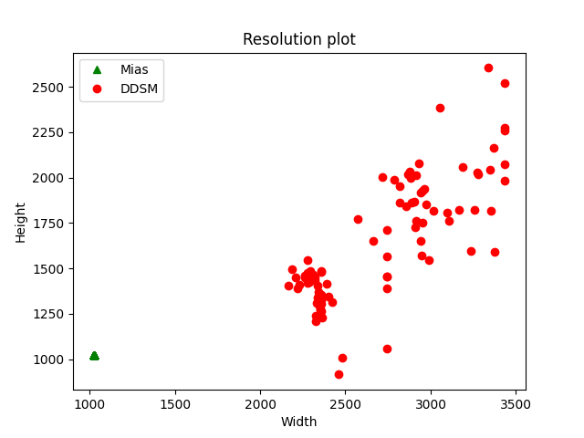
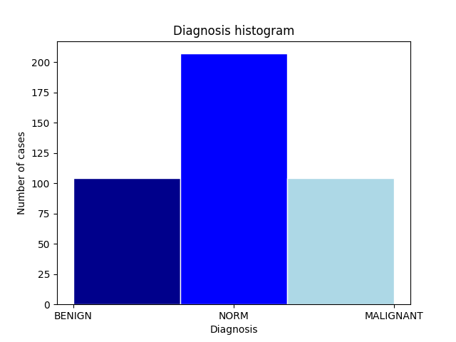
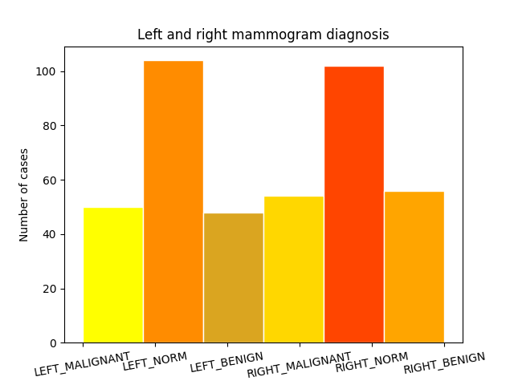
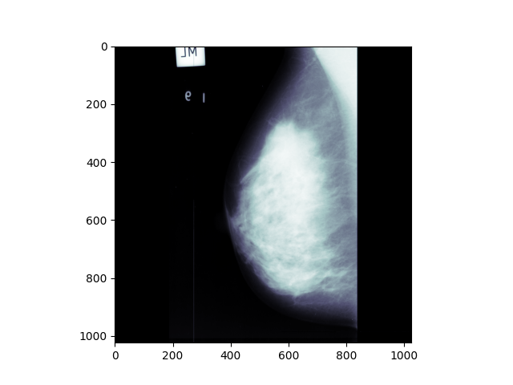
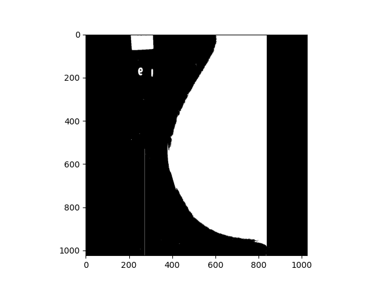
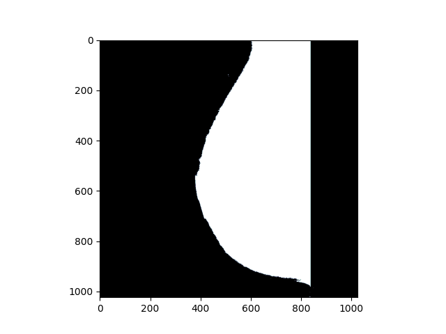
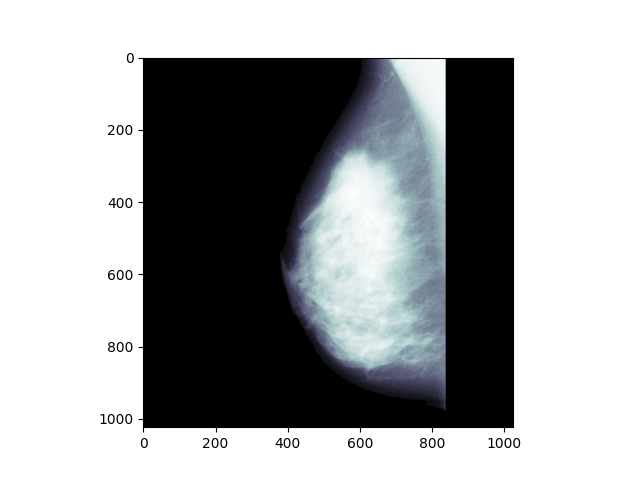

<h1>Breast Cancer Detection</h1>
Breast Cancer Detection Using Machine Learning

<h2>What is Breast Cancer?</h2>
Cancer occurs when mutations take place in genes that regulate cell growth. The mutations let the cells divide and multiply in an uncontrolled, chaotic way. 
The cells keep on proliferating, producing copies that get progressively more abnormal. In most cases, the cell copies eventually end up forming a tumor.
Breast cancer occurs when a tumor originates in the breast. As breast cancer tumors mature, they may metastasize (spread) to other parts of the body. 
The primary route of metastasis is the lymphatic system which, is also the body's primary system for producing and transporting white blood cells and other 
cancer-fighting immune system cells throughout the body. Metastasized cancer cells that aren't destroyed by the lymphatic system's white blood cells move 
through the lymphatic vessels and settle in remote body locations, forming new tumors and perpetuating the disease process. Breast cancer is not just a woman's disease. 
It is quite possible for men to get breast cancer, although it occurs less frequently in men than in women.
<h2>Project Description</h2>
We tried to develop a CAD system that can facilitate the diagnosis of breast cancer, with respect to the EU recommendations and
AI techniques. In order to achieve this we trained our model with mammograms from the MIAS dataset and a part 
of the mini DDSM database.
<h2>The technique we used</h2>
The project is inspired by these publications and research papers:
<ol><li>A Preprocessing Algorithm for the CAD System of Mammograms Using the Active Contour Method: Farhan AKRAM, Jeong Heon KIM, Inteck WHOANG, and Kwang Nam CHOI
</li><li>MAMMOGRAM ANALYSIS BASED ON MACHINE LEARNING ALGORITHMS: A COMPARATIVE STUDY: S. Mohamed Malik, A. Alharbi
</li><li>Mammography Images Segmentation via Fuzzy C-mean and K-mean: Mohammed Y. Kamil, Ali Mohammed Salih
</li></ol>

The steps we  followed:
<ul>
<li>Choosing the data
</li>
<li>Preprocessing
</li><li>Feature extraction
</li><li>Training a binary classification model
</li><li>Image segmentation for tumor detection
</li>
</ul>

<h3>Choosing the data</h3>
As the MIAS dataset presented many normal mammograms, we chose to balance the 
dataset by using all 322 images from MIAS and another 93 malignant and benign mammograms 
from DDSM. Here are some of the plots we created in the incipient stage of our project in order to get a 
better understanding of the dataset and of the problem:

The ground truth of the MIAS dataset is represented by a .txt file where each image is described as 
NORM, BENIGN or MALIGNANT, and in each case of malformation there is a center, and a radius that describe the
ground truth. For DDSM the images are divided into two folders and each image has a mask that defines the contour 
of the tumor, and an overlay that indicates which pixels form the border of the malformation.
<h3>Preprocessing</h3>
Our main purpose in this part of our project was to remove any labels and scanning artifacts by using a 
thresholding algorithm. First, it takes a mammogram image and applies a thresholding to acquire a binary image,
using the threshold value T=15. Then it divides the image vertically in half, as to attain two groups.
Thereafter, it computes the pixel sum for both groups and compares these to check which one is greater in order 
to decide the starting point of the pointer. After finding the starting point it traverses the pointer in every
row and removes the unnecessary data in the image, i.e., labels and scanning artifacts.After removing the unnecessary data,
it checks each pixel: if in the binary image a pixel is black it should also be black in the original mammogram image.

<h4>Original image</h4>

<h4>Binary image</h4>

<h4>Binary image after removing the unnecessary data</h4>

<h4>Final mammogram</h4>

