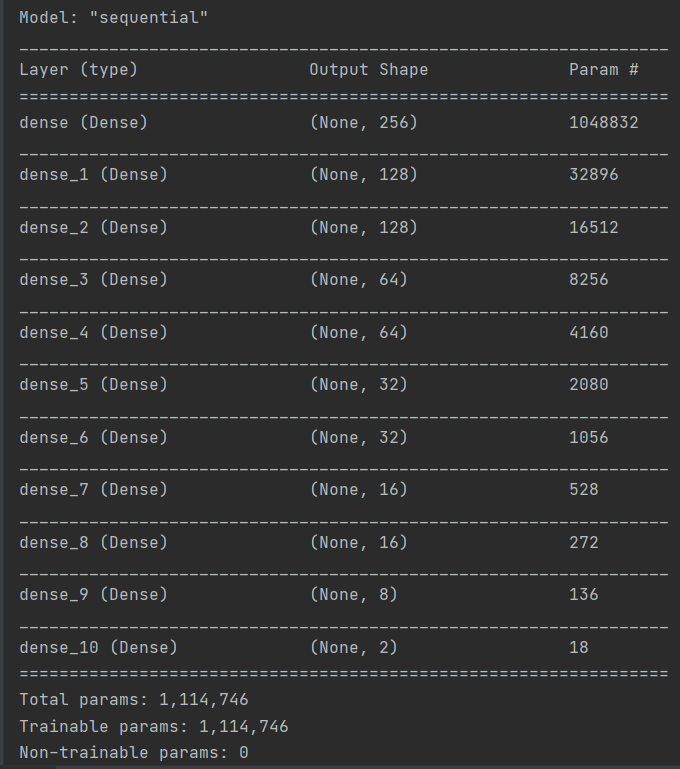
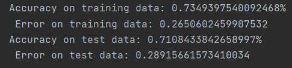
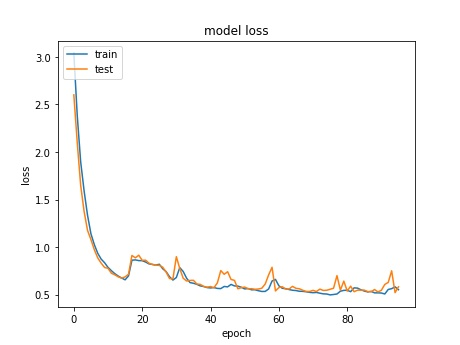
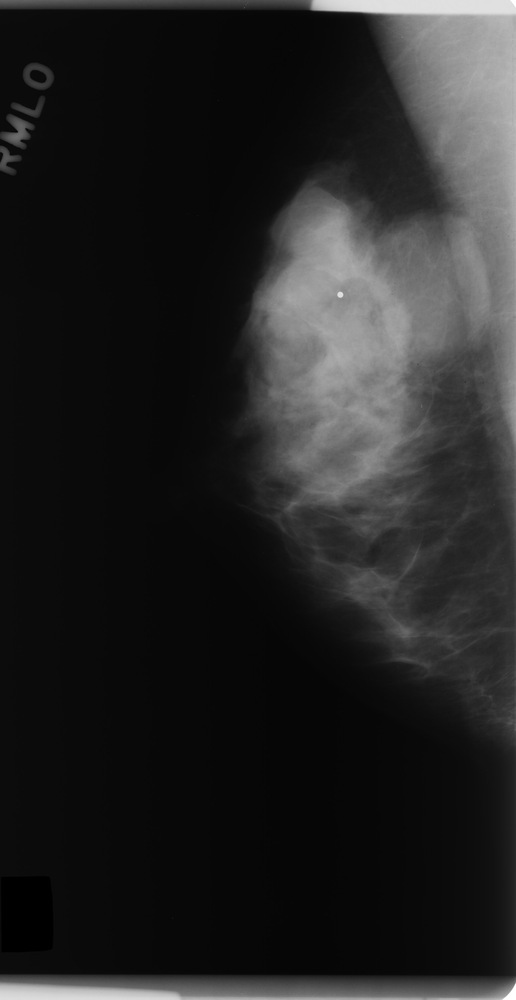
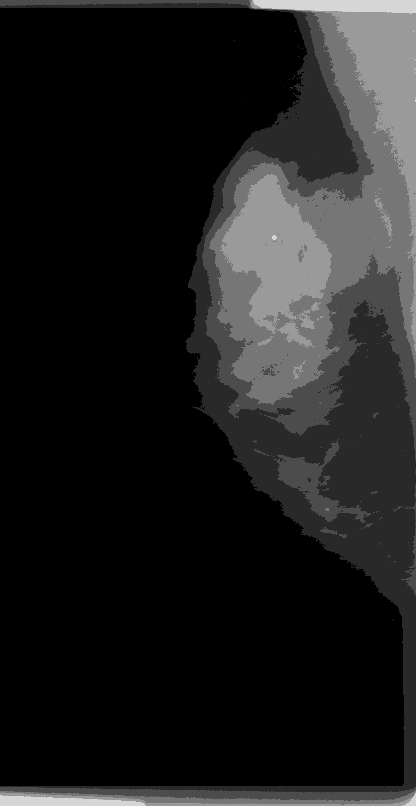
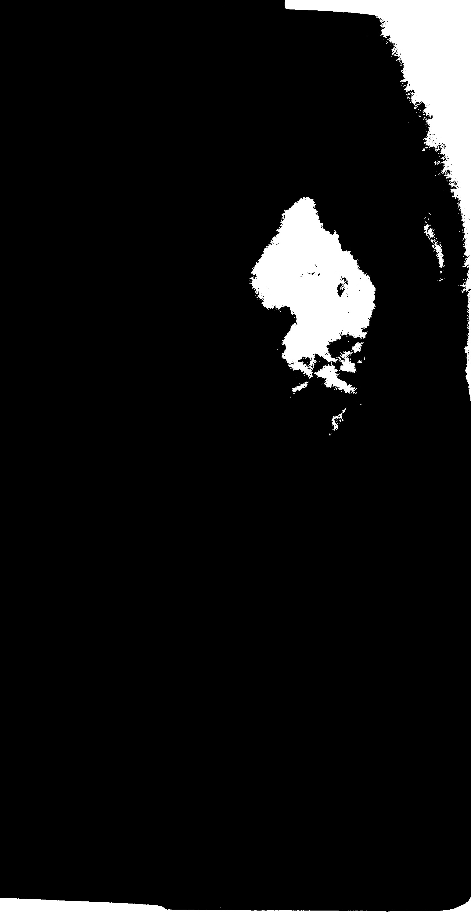
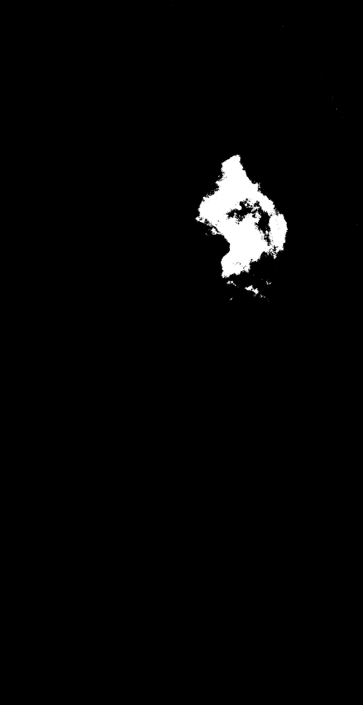

<h1>Breast Cancer Detection</h1>
Breast Cancer Detection Using Machine Learning

<h2>What is Breast Cancer?</h2>
Cancer occurs when mutations take place in genes that regulate cell growth. The mutations let the cells divide and multiply in an uncontrolled, chaotic way. 
The cells keep on proliferating, producing copies that get progressively more abnormal. In most cases, the cell copies eventually end up forming a tumor.
Breast cancer occurs when a tumor originates in the breast. As breast cancer tumors mature, they may metastasize (spread) to other parts of the body. 
The primary route of metastasis is the lymphatic system which, is also the body's primary system for producing and transporting white blood cells and other 
cancer-fighting immune system cells throughout the body. Metastasized cancer cells that aren't destroyed by the lymphatic system's white blood cells move 
through the lymphatic vessels and settle in remote body locations, forming new tumors and perpetuating the disease process. Breast cancer is not just a woman's disease. 
It is quite possible for men to get breast cancer, although it occurs less frequently in men than in women.
<h2>Project Description</h2>
We tried to develop a CAD system that can facilitate the diagnosis of breast cancer, with respect to the EU recommendations and
AI techniques. In order to achieve this we trained our model with mammograms from the MIAS dataset and a part 
of the mini DDSM database.
<h2>The technique we used</h2>
The project is inspired by these publications and research papers:
<ol><li>A Preprocessing Algorithm for the CAD System of Mammograms Using the Active Contour Method: Farhan AKRAM, Jeong Heon KIM, Inteck WHOANG, and Kwang Nam CHOI
</li><li>MAMMOGRAM ANALYSIS BASED ON MACHINE LEARNING ALGORITHMS: A COMPARATIVE STUDY: S. Mohamed Malik, A. Alharbi
</li><li>Mammography Images Segmentation via Fuzzy C-mean and K-mean: Mohammed Y. Kamil, Ali Mohammed Salih
</li></ol>

The steps we  followed:
<ul>
<li>Choosing the data
</li>
<li>Preprocessing
</li><li>Feature extraction
</li><li>Training a binary classification model
</li><li>Image segmentation for tumor detection
</li>
</ul>

<h3>Choosing the data</h3>
As the MIAS dataset presented many normal mammograms, we chose to balance the 
dataset by using all 322 images from MIAS and another 93 malignant and benign mammograms 
from DDSM. Here are some of the plots we created in the incipient stage of our project in order to get a 
better understanding of the dataset and of the problem:

The ground truth of the MIAS dataset is represented by a .txt file where each image is described as 
NORM, BENIGN or MALIGNANT, and in each case of malformation there is a center, and a radius that describe the
ground truth. For DDSM the images are divided into two folders and each image has a mask that defines the contour 
of the tumor, and an overlay that indicates which pixels form the border of the malformation.
<h3>Preprocessing</h3>
Our main purpose in this part of our project was to remove any labels and scanning artifacts by using a 
thresholding algorithm. First, it takes a mammogram image and applies a thresholding to acquire a binary image,
using the threshold value T=15. Then it divides the image vertically in half, as to attain two groups.
Thereafter, it computes the pixel sum for both groups and compares these to check which one is greater in order 
to decide the starting point of the pointer. After finding the starting point it traverses the pointer in every
row and removes the unnecessary data in the image, i.e., labels and scanning artifacts. After removing the unnecessary data,
it checks each pixel: if in the binary image a pixel is black it should also be black in the original mammogram image.

<h4>Original image</h4>

<h4>Binary image</h4>

<h4>Binary image after removing the unnecessary data</h4>

<h4>Final mammogram</h4>

<h3>Feature extraction</h3>
For feature extraction we used an already pre-trained model from PyTorch based on the VGG-16 architecture. 
This model was trained using ImageNet dataset. Normally, we can identify two main blocks inside of a typical CNN:
the feature extraction part and the classification one. The feature extraction is made of a series of convolutional 
and pooling layers which extract features from the image, increasing in complexity in each layer (i.e. from simpler features 
in the first layers as points, to more complex ones in the last layers like edges and shapes). As we only want to extract features we took the feature layer,
the average pooling layer, and one fully-connected layer that outputs a 4096-dimensional vector. After we extract each layer, 
we create a new class called FeatureExtractor that inherits the nn.Module from PyTorch. 
<h3>Training a binary classification model</h3>

In order to train a model for our classification problem we used Keras. We divided the dataset into two groups:
normal mammograms and images with malformations (benign and malignant). Our purpose was to separate the healthy patients
in order to help the specialists focus on the potentially ill people. Our model has eleven layers and in order to prevent 
problems such as overfitting we used early stopping as a strategy.

 Our model has the following blueprint: 
<h4>Binary classification model</h4>

In terms of performance our model has the following accuracy:
<h4>Accuracy</h4>

Moreover, this is a graphic that demonstrates the loss evolution during testing and training:
<h4>Loss evolution</h4>

<h3>Image segmentation for tumor detection</h3>
For image segmentation we used the K-Means Clustering method.
K-means Clustering is a strong statistical method for grouping data points to their closest
neighbor and thus developing clusters of data points. It starts by setting K centroid areas
randomly or in the light of some heuristic. After all the pixels remain in a cluster membership, the image
is segmented into these clusters. After that, a threshold is applied in order to accentuate the tumor
(the brightest part of the mammogram). As the pectoral muscle is also a very bright part of the image
we used an algorithm to clean the borders of the image. For clearing the binary image (the one obtained by thresholding), 
we used a flood-fill based algorithm. Because the white borders had black lines between them, 
we added a "deep" to the algorithm in order to bypass the problem. This deep indicates how much further should it check for white pixels. The optimal deep found was 3.

<h4>Original image</h4>

<h4>Segmented image using k-means</h4>

<h4>Binary image</h4>

<h4>Cleared image</h4>

<h4>Jaccard score</h4>
In order to see the performance of our algorithm we generated the images with the tumors for all the DDSM malignant
and benign mammograms, and we compared them with their mask. As the mask was only represented by the border of the 
malformation we colored with white the inside of the contour.

<h4>Normal mask</h4>

<h4>After colouring</h4>

